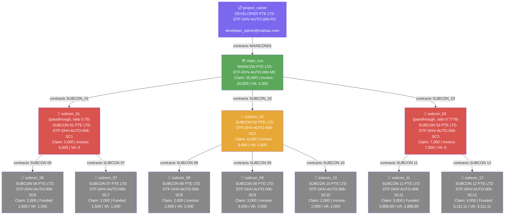

# DTF Tree Report — DTF-DHV-AUTO-006 (September 2026)

> Generated: 2026-06-19 | Source: data_006_sept.json

---

## Summary

| | Value |
|---|---|
| Project Code | DTF-DHV-AUTO-006 |
| Claim Month | September 2026 |
| Total Actors | 12 |
| Non-leaf actors (with requisition) | 4 |
| Leaf actors (claim only) | 7 |
| Max tree depth | 3 (PO → Maincon → SC01/02/03 → leaves) |
| Maincon claim | 20,000 |
| Sum of all VA (Rule 4, cascaded) | 20,000 |
| Conservation check | ✅ **Holds** — see VA Calculation below |

---

## Actor List

| Key | Vendor Name | Project Code | Email | Role |
|---|---|---|---|---|
| project_owner | DEVELOPER PTE LTD | DTF-DHV-AUTO-006-PO | developer_admin@mailsac.com | Project Owner |
| main_con | MAINCON PTE LTD | DTF-DHV-AUTO-006-MC | maincon_admin@mailsac.com | Main Contractor |
| subcon_01 | SUBCON 01 PTE LTD | DTF-DHV-AUTO-006-SC1 | subcon_01@mailsac.com | Subcontractor |
| subcon_02 | SUBCON 02 PTE LTD | DTF-DHV-AUTO-006-SC2 | subcon_02@mailsac.com | Subcontractor |
| subcon_03 | SUBCON 03 PTE LTD | DTF-DHV-AUTO-006-SC3 | subcon_03@mailsac.com | Subcontractor |
| subcon_06 | SUBCON 06 PTE LTD | DTF-DHV-AUTO-006-SC6 | subcon_06@mailsac.com | Leaf |
| subcon_07 | SUBCON 07 PTE LTD | DTF-DHV-AUTO-006-SC7 | subcon_07@mailsac.com | Leaf |
| subcon_08 | SUBCON 08 PTE LTD | DTF-DHV-AUTO-006-SC8 | subcon_08@mailsac.com | Leaf |
| subcon_09 | SUBCON 09 PTE LTD | DTF-DHV-AUTO-006-SC9 | subcon_09@mailsac.com | Leaf |
| subcon_10 | SUBCON 10 PTE LTD | DTF-DHV-AUTO-006-SC10 | subcon_10@mailsac.com | Leaf |
| subcon_11 | SUBCON 11 PTE LTD | DTF-DHV-AUTO-006-SC11 | subcon_11@mailsac.com | Leaf |
| subcon_12 | SUBCON 12 PTE LTD | DTF-DHV-AUTO-006-SC12 | subcon_12@mailsac.com | Leaf |

---

## Vendor Connections

| Actor | Contracts To | Receives WR From |
|---|---|---|
| project_owner | MAINCON PTE LTD | — |
| main_con | SUBCON 01, SUBCON 02, SUBCON 03 | project_owner |
| subcon_01 | SUBCON 06, SUBCON 07 | main_con |
| subcon_02 | SUBCON 08, SUBCON 09, SUBCON 10 | main_con |
| subcon_03 | SUBCON 11, SUBCON 12 | main_con |
| subcon_06 | — *(leaf)* | subcon_01 |
| subcon_07 | — *(leaf)* | subcon_01 |
| subcon_08 | — *(leaf)* | subcon_02 |
| subcon_09 | — *(leaf)* | subcon_02 |
| subcon_10 | — *(leaf)* | subcon_02 |
| subcon_11 | — *(leaf)* | subcon_03 |
| subcon_12 | — *(leaf)* | subcon_03 |

---

## Tree Structure

```
DEVELOPER PTE LTD (project_owner) — DTF-DHV-AUTO-006-PO
└── MAINCON PTE LTD (main_con) — DTF-DHV-AUTO-006-MC
    ├── SUBCON 01 PTE LTD (subcon_01) — DTF-DHV-AUTO-006-SC1  [passthrough]
    │   ├── SUBCON 06 PTE LTD (subcon_06) — DTF-DHV-AUTO-006-SC6  [leaf]
    │   └── SUBCON 07 PTE LTD (subcon_07) — DTF-DHV-AUTO-006-SC7  [leaf]
    ├── SUBCON 02 PTE LTD (subcon_02) — DTF-DHV-AUTO-006-SC2
    │   ├── SUBCON 08 PTE LTD (subcon_08) — DTF-DHV-AUTO-006-SC8  [leaf]
    │   ├── SUBCON 09 PTE LTD (subcon_09) — DTF-DHV-AUTO-006-SC9  [leaf]
    │   └── SUBCON 10 PTE LTD (subcon_10) — DTF-DHV-AUTO-006-SC10  [leaf]
    └── SUBCON 03 PTE LTD (subcon_03) — DTF-DHV-AUTO-006-SC3  [passthrough]
        ├── SUBCON 11 PTE LTD (subcon_11) — DTF-DHV-AUTO-006-SC11  [leaf]
        └── SUBCON 12 PTE LTD (subcon_12) — DTF-DHV-AUTO-006-SC12  [leaf]
```

---

## Mermaid Diagram



*Red nodes (subcon_01, subcon_03) are passthrough — VA = 0 because their own claim is lower than the sum of their children's claims. Their funding-shortfall ratio cascades down to their leaf children (Rule 4), capping the leaves' VA below their own raw claim.*

---

## VA Calculation (Rule 4 — cascading passthrough)

| Actor | Claim | Funded Invoice | Children Sum | Expected VA | Formula |
|---|---|---|---|---|---|
| main_con | 20,000 | 20,000 | 18,000 | **2,000** | 20000 − (3000+8000+7000) |
| subcon_01 | 3,000 | 3,000 (×1) | 4,000 | **0** | passthrough: 3000 < (2000+2000) → ratio = 3000/4000 = 0.75 |
| subcon_02 | 8,000 | 8,000 (×1) | 7,000 | **1,000** | 8000 − (2000+3000+2000) |
| subcon_03 | 7,000 | 7,000 (×1) | 9,000 | **0** | passthrough: 7000 < (5000+4000) → ratio = 7000/9000 = 0.7778 |
| subcon_06 | 2,000 | 1,500 (×0.75) | 0 | **1,500** | leaf, funded by SC01's ratio |
| subcon_07 | 2,000 | 1,500 (×0.75) | 0 | **1,500** | leaf, funded by SC01's ratio |
| subcon_08 | 2,000 | 2,000 (×1) | 0 | **2,000** | leaf, fully funded |
| subcon_09 | 3,000 | 3,000 (×1) | 0 | **3,000** | leaf, fully funded |
| subcon_10 | 2,000 | 2,000 (×1) | 0 | **2,000** | leaf, fully funded |
| subcon_11 | 5,000 | 3,888.89 (×0.7778) | 0 | **3,888.89** | leaf, funded by SC03's ratio |
| subcon_12 | 4,000 | 3,111.11 (×0.7778) | 0 | **3,111.11** | leaf, funded by SC03's ratio |
| **Sum of VA** | | | | **20,000** | ✅ matches root invoice |

**Conservation note:** Both `subcon_01` and `subcon_03` trigger passthrough this month. Per Rule 4 (`formula.md`), the unfunded ratio cascades down to each branch's leaf children rather than stopping at the passthrough node — this is what keeps `SUM(all VA) == root invoice` (20,000) exact, despite two separate under-funded branches in the same tree.

---

## Requisition Details

| Actor | csv_filename | Vendors | Contract Title | Type |
|---|---|---|---|---|
| project_owner | Project Owner - Maincon 1.csv | MAINCON01 (MAINCON PTE LTD) | WR-DHV-Auto-006 | LUMP_SUM |
| main_con | Main Con - Subcon 1.csv | SUBCON_01, SUBCON_02, SUBCON_03 | WR-DHV-Auto-006 | LUMP_SUM |
| subcon_01 | Subcon 1 - Subcon 2.csv | SUBCON 06, SUBCON 07 | WR-DHV-Auto-006 | LUMP_SUM |
| subcon_02 | Subcon 1 - Subcon 2.csv | SUBCON 08, SUBCON 09, SUBCON 10 | WR-DHV-Auto-006 | LUMP_SUM |
| subcon_03 | Subcon 1 - Subcon 2.csv | SUBCON 11, SUBCON 12 | WR-DHV-Auto-006 | LUMP_SUM |
| subcon_06 | — | — | — | leaf |
| subcon_07 | — | — | — | leaf |
| subcon_08 | — | — | — | leaf |
| subcon_09 | — | — | — | leaf |
| subcon_10 | — | — | — | leaf |
| subcon_11 | — | — | — | leaf |
| subcon_12 | — | — | — | leaf |

---

## Claim Details

| Actor | PC Reference | PR Reference | Claim Amount | Expected VA | Invoice Number |
|---|---|---|---|---|---|
| project_owner | — | PR-DTF-DHV-AUTO-006-PO | — | — | INV-DTF-DHV-AUTO-006-PO-September |
| main_con | PC-DTF-DHV-AUTO-006-MC | PR-DTF-DHV-AUTO-006-MC | 20,000 | 2,000 | INV-DTF-DHV-AUTO-006-MC-September |
| subcon_01 | PC-DTF-DHV-AUTO-006-SC1 | PR-DTF-DHV-AUTO-006-SC1 | 3,000 | 0 | INV-DTF-DHV-AUTO-006-SC1-September |
| subcon_02 | PC-DTF-DHV-AUTO-006-SC2 | PR-DTF-DHV-AUTO-006-SC2 | 8,000 | 1,000 | INV-DTF-DHV-AUTO-006-SC2-September |
| subcon_03 | PC-DTF-DHV-AUTO-006-SC3 | PR-DTF-DHV-AUTO-006-SC3 | 7,000 | 0 | INV-DTF-DHV-AUTO-006-SC3-September |
| subcon_06 | PC-DTF-DHV-AUTO-006-SC6 | PR-DTF-DHV-AUTO-006-SC6 | 2,000 | 1,500 | INV-DTF-DHV-AUTO-006-SC6-September |
| subcon_07 | PC-DTF-DHV-AUTO-006-SC7 | PR-DTF-DHV-AUTO-006-SC7 | 2,000 | 1,500 | INV-DTF-DHV-AUTO-006-SC7-September |
| subcon_08 | PC-DTF-DHV-AUTO-006-SC8 | PR-DTF-DHV-AUTO-006-SC8 | 2,000 | 2,000 | INV-DTF-DHV-AUTO-006-SC8-September |
| subcon_09 | PC-DTF-DHV-AUTO-006-SC9 | PR-DTF-DHV-AUTO-006-SC9 | 3,000 | 3,000 | INV-DTF-DHV-AUTO-006-SC9-September |
| subcon_10 | PC-DTF-DHV-AUTO-006-SC10 | PR-DTF-DHV-AUTO-006-SC10 | 2,000 | 2,000 | INV-DTF-DHV-AUTO-006-SC10-September |
| subcon_11 | PC-DTF-DHV-AUTO-006-SC11 | PR-DTF-DHV-AUTO-006-SC11 | 5,000 | 3,888.89 | INV-DTF-DHV-AUTO-006-SC11-September |
| subcon_12 | PC-DTF-DHV-AUTO-006-SC12 | PR-DTF-DHV-AUTO-006-SC12 | 4,000 | 3,111.11 | INV-DTF-DHV-AUTO-006-SC12-September |
