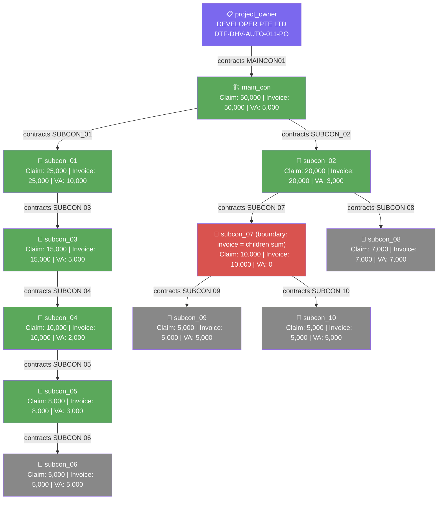

# DTF Tree Report — DTF-DHV-AUTO-011 (August 2026)

> Generated: 2026-07-08 | Source: data_dhv11-august26.json

---

## Summary

| | Value |
|---|---|
| Project Code | DTF-DHV-AUTO-011 |
| Claim Month | August 2026 |
| Total Actors | 12 (project_owner + main_con + 10 subcons) |
| Non-leaf actors (with requisition) | 7 (main_con, subcon_01–05, subcon_07) + project_owner |
| Leaf actors (claim only) | 4 (subcon_06, subcon_08, subcon_09, subcon_10) |
| Max tree depth | 7 nodes (PO → MC → SC01 → SC03 → SC04 → SC05 → SC06) |
| Maincon claim / invoice | 50,000 / 50,000 |
| Sum of all VA | 50,000.00 |
| Conservation check | ✅ **Holds exactly — no rounding residual** (all values are whole numbers) |
| Special note | `subcon_07` has VA = 0 via **exact equality** (own invoice 10,000 = children sum 5,000+5,000), not a shortfall — this is a boundary case of the fully-funded rule, not a passthrough |

---

## Actor List

| Key | Vendor Name | Project Code | Email | Role |
|---|---|---|---|---|
| project_owner | DEVELOPER PTE LTD | DTF-DHV-AUTO-011-PO | developer_admin@mailsac.com | Project Owner |
| main_con | MAINCON PTE LTD | DTF-DHV-AUTO-011-MC | maincon_admin@mailsac.com | Main Contractor |
| subcon_01 | SUBCON 01 PTE LTD | DTF-DHV-AUTO-011-SC1 | subcon_01@mailsac.com | Subcontractor |
| subcon_02 | SUBCON 02 PTE LTD | DTF-DHV-AUTO-011-SC2 | subcon_02@mailsac.com | Subcontractor |
| subcon_03 | SUBCON 03 PTE LTD | DTF-DHV-AUTO-011-SC3 | subcon_03@mailsac.com | Subcontractor |
| subcon_04 | SUBCON 04 PTE LTD | DTF-DHV-AUTO-011-SC4 | subcon_04@mailsac.com | Subcontractor |
| subcon_05 | SUBCON 05 PTE LTD | DTF-DHV-AUTO-011-SC5 | subcon_05@mailsac.com | Subcontractor |
| subcon_06 | SUBCON 06 PTE LTD | DTF-DHV-AUTO-011-SC6 | subcon_06@mailsac.com | Leaf |
| subcon_07 | SUBCON 07 PTE LTD | DTF-DHV-AUTO-011-SC7 | subcon_07@mailsac.com | Subcontractor |
| subcon_08 | SUBCON 08 PTE LTD | DTF-DHV-AUTO-011-SC8 | subcon_08@mailsac.com | Leaf |
| subcon_09 | SUBCON 09 PTE LTD | DTF-DHV-AUTO-011-SC9 | subcon_09@mailsac.com | Leaf |
| subcon_10 | SUBCON 10 PTE LTD | DTF-DHV-AUTO-011-SC10 | subcon_10@mailsac.com | Leaf |

---

## Vendor Connections

| Actor | Contracts To | Receives WR From |
|---|---|---|
| project_owner | MAINCON PTE LTD | — |
| main_con | SUBCON 01, SUBCON 02 | project_owner |
| subcon_01 | SUBCON 03 | main_con |
| subcon_02 | SUBCON 07, SUBCON 08 | main_con |
| subcon_03 | SUBCON 04 | subcon_01 |
| subcon_04 | SUBCON 05 | subcon_03 |
| subcon_05 | SUBCON 06 | subcon_04 |
| subcon_06 | — *(leaf)* | subcon_05 |
| subcon_07 | SUBCON 09, SUBCON 10 | subcon_02 |
| subcon_08 | — *(leaf)* | subcon_02 |
| subcon_09 | — *(leaf)* | subcon_07 |
| subcon_10 | — *(leaf)* | subcon_07 |

---

## Tree Structure

```
DEVELOPER PTE LTD (project_owner) — DTF-DHV-AUTO-011-PO
└── MAINCON PTE LTD (main_con) — DTF-DHV-AUTO-011-MC
    ├── SUBCON 01 PTE LTD (subcon_01) — DTF-DHV-AUTO-011-SC1
    │   └── SUBCON 03 PTE LTD (subcon_03) — DTF-DHV-AUTO-011-SC3
    │       └── SUBCON 04 PTE LTD (subcon_04) — DTF-DHV-AUTO-011-SC4
    │           └── SUBCON 05 PTE LTD (subcon_05) — DTF-DHV-AUTO-011-SC5
    │               └── SUBCON 06 PTE LTD (subcon_06) — DTF-DHV-AUTO-011-SC6  [leaf]
    └── SUBCON 02 PTE LTD (subcon_02) — DTF-DHV-AUTO-011-SC2
        ├── SUBCON 07 PTE LTD (subcon_07) — DTF-DHV-AUTO-011-SC7  [VA=0, boundary]
        │   ├── SUBCON 09 PTE LTD (subcon_09) — DTF-DHV-AUTO-011-SC9  [leaf]
        │   └── SUBCON 10 PTE LTD (subcon_10) — DTF-DHV-AUTO-011-SC10  [leaf]
        └── SUBCON 08 PTE LTD (subcon_08) — DTF-DHV-AUTO-011-SC8  [leaf]
```

The left branch (MC → SC01 → SC03 → SC04 → SC05 → SC06) is 6 subcon levels deep — the deepest single chain tested to date. All nodes on this chain are fully funded with positive VA; none are passthrough.

---

## Mermaid Diagram



*Green = fully funded with positive VA; red = VA = 0 (`subcon_07` boundary case — own invoice exactly equals children sum, zero slack); grey = leaf node.*

---

## VA Calculation (Rule 4 — all nodes fully funded, no cascade needed)

| Actor | Invoice | Funded Invoice | Children Sum | Expected VA | Note |
|---|---|---|---|---|---|
| main_con | 50,000 | 50,000.00 (×1, root) | 45,000.00 | **5,000** | fully funded |
| subcon_01 | 25,000 | 25,000.00 (×1) | 15,000.00 | **10,000** | fully funded |
| subcon_02 | 20,000 | 20,000.00 (×1) | 17,000.00 | **3,000** | fully funded |
| subcon_03 | 15,000 | 15,000.00 (×1) | 10,000.00 | **5,000** | fully funded |
| subcon_04 | 10,000 | 10,000.00 (×1) | 8,000.00 | **2,000** | fully funded |
| subcon_05 | 8,000 | 8,000.00 (×1) | 5,000.00 | **3,000** | fully funded |
| subcon_06 | 5,000 | 5,000.00 (×1) | 0 | **5,000** | leaf |
| subcon_07 | 10,000 | 10,000.00 (×1) | 10,000.00 | **0** | boundary: invoice = children sum exactly, VA = 0, ratio = 1 |
| subcon_08 | 7,000 | 7,000.00 (×1) | 0 | **7,000** | leaf |
| subcon_09 | 5,000 | 5,000.00 (×1) | 0 | **5,000** | leaf |
| subcon_10 | 5,000 | 5,000.00 (×1) | 0 | **5,000** | leaf |
| **Sum of VA** | | | | **50,000.00** | ✅ exact match to root invoice |

Because every node is fully funded (own invoice ≥ children sum), the cascade ratio is 1 throughout the entire tree. No proportional scaling is applied at any level. `subcon_07` is the one node where VA = 0 despite being fully funded — its own invoice equals its children's sum to the cent (10,000 = 5,000 + 5,000), leaving zero slack. This is the boundary form of Rule 3: VA = funded − childrenSum = 0, and the ratio passed to `subcon_09`/`subcon_10` is still 1, so both receive their full invoice amounts as VA.

All `claim_amount` values equal `invoice_amount` in this tree — no pending/separate-invoice scenario applies.

---

## Requisition Details

| Actor | csv_filename | Vendors | Contract Title | Type |
|---|---|---|---|---|
| project_owner | Project Owner - Maincon 1.csv | MAINCON01 (MAINCON PTE LTD) | WR-DHV-Aug26 | LUMP_SUM |
| main_con | Main Con - Subcon 1.csv | SUBCON_01, SUBCON_02 | WR-DHV-Aug26 | LUMP_SUM |
| subcon_01 | Subcon 1 - Subcon 2.csv | SUBCON 03 | WR-DHV-Aug26 | LUMP_SUM |
| subcon_02 | Subcon 1 - Subcon 2.csv | SUBCON 07, SUBCON 08 | WR-DHV-Aug26 | LUMP_SUM |
| subcon_03 | Subcon 1 - Subcon 2.csv | SUBCON 04 | WR-DHV-Aug26 | LUMP_SUM |
| subcon_04 | Subcon 1 - Subcon 2.csv | SUBCON 05 | WR-DHV-Aug26 | LUMP_SUM |
| subcon_05 | Subcon 1 - Subcon 2.csv | SUBCON 06 | WR-DHV-Aug26 | LUMP_SUM |
| subcon_07 | Subcon 1 - Subcon 2.csv | SUBCON 09, SUBCON 10 | WR-DHV-Aug26 | LUMP_SUM |
| subcon_06 | — | — | — | leaf |
| subcon_08 | — | — | — | leaf |
| subcon_09 | — | — | — | leaf |
| subcon_10 | — | — | — | leaf |

---

## Claim Details

| Actor | PC Reference | PR Reference | Claim Amount | Invoice Amount | Expected VA | Invoice Number |
|---|---|---|---|---|---|---|
| project_owner | — | PR-DTF-DHV-AUTO-011-PO | — | — | — | INV-DTF-DHV-AUTO-011-PO-August |
| main_con | PC-DTF-DHV-AUTO-011-MC | PR-DTF-DHV-AUTO-011-MC | 50,000 | 50,000 | 5,000 | INV-DTF-DHV-AUTO-011-MC-August |
| subcon_01 | PC-DTF-DHV-AUTO-011-SC1 | PR-DTF-DHV-AUTO-011-SC1 | 25,000 | 25,000 | 10,000 | INV-DTF-DHV-AUTO-011-SC1-August |
| subcon_02 | PC-DTF-DHV-AUTO-011-SC2 | PR-DTF-DHV-AUTO-011-SC2 | 20,000 | 20,000 | 3,000 | INV-DTF-DHV-AUTO-011-SC2-August |
| subcon_03 | PC-DTF-DHV-AUTO-011-SC3 | PR-DTF-DHV-AUTO-011-SC3 | 15,000 | 15,000 | 5,000 | INV-DTF-DHV-AUTO-011-SC3-August |
| subcon_04 | PC-DTF-DHV-AUTO-011-SC4 | PR-DTF-DHV-AUTO-011-SC4 | 10,000 | 10,000 | 2,000 | INV-DTF-DHV-AUTO-011-SC4-August |
| subcon_05 | PC-DTF-DHV-AUTO-011-SC5 | PR-DTF-DHV-AUTO-011-SC5 | 8,000 | 8,000 | 3,000 | INV-DTF-DHV-AUTO-011-SC5-August |
| subcon_06 | PC-DTF-DHV-AUTO-011-SC6 | PR-DTF-DHV-AUTO-011-SC6 | 5,000 | 5,000 | 5,000 | INV-DTF-DHV-AUTO-011-SC6-August |
| subcon_07 | PC-DTF-DHV-AUTO-011-SC7 | PR-DTF-DHV-AUTO-011-SC7 | 10,000 | 10,000 | 0 | INV-DTF-DHV-AUTO-011-SC7-August |
| subcon_08 | PC-DTF-DHV-AUTO-011-SC8 | PR-DTF-DHV-AUTO-011-SC8 | 7,000 | 7,000 | 7,000 | INV-DTF-DHV-AUTO-011-SC8-August |
| subcon_09 | PC-DTF-DHV-AUTO-011-SC9 | PR-DTF-DHV-AUTO-011-SC9 | 5,000 | 5,000 | 5,000 | INV-DTF-DHV-AUTO-011-SC9-August |
| subcon_10 | PC-DTF-DHV-AUTO-011-SC10 | PR-DTF-DHV-AUTO-011-SC10 | 5,000 | 5,000 | 5,000 | INV-DTF-DHV-AUTO-011-SC10-August |
