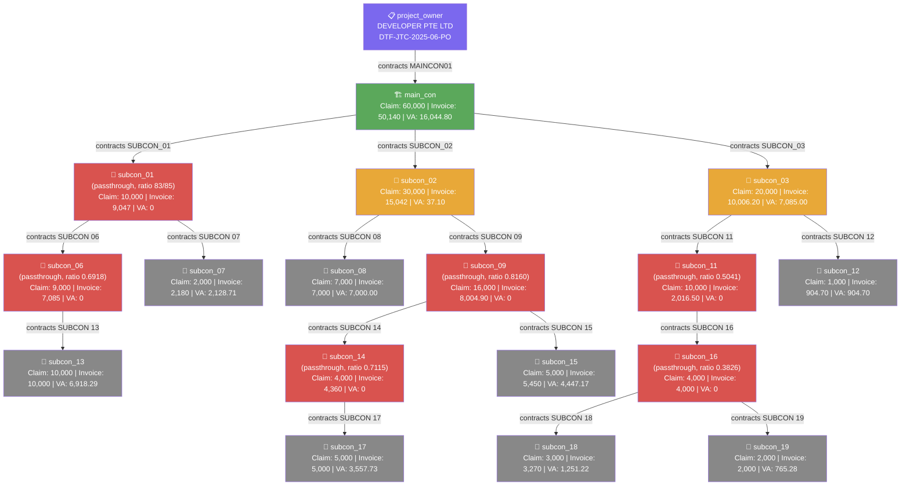

# DTF Tree Report — DTF-JTC-2025-06 (June 2025)

> Generated: 2026-06-19 | Source: data_jtc_june25.json

---

## Summary

| | Value |
|---|---|
| Project Code | DTF-JTC-2025-06 |
| Claim Month | June 2025 |
| Total Actors | 18 |
| Non-leaf actors (with requisition) | 9 (+ project_owner) |
| Leaf actors (claim only) | 8 |
| Max tree depth | 6 nodes (PO → MC → SC02 → SC09 → SC14 → SC17; and PO → MC → SC03 → SC11 → SC16 → SC18/19) |
| Maincon claim / invoice | 60,000 / 50,140 |
| Sum of all VA | 50,140.00 |
| Conservation check | ✅ **Holds exactly** — see VA Calculation below |

---

## Actor List

| Key | Vendor Name | Project Code | Email | Role |
|---|---|---|---|---|
| project_owner | DEVELOPER PTE LTD | DTF-JTC-2025-06-PO | developer_admin@mailsac.com | Project Owner |
| main_con | MAINCON PTE LTD | DTF-JTC-2025-06-MC | maincon_admin@mailsac.com | Main Contractor |
| subcon_01 | SUBCON 01 PTE LTD | DTF-JTC-2025-06-SC1 | subcon_01@mailsac.com | Subcontractor |
| subcon_02 | SUBCON 02 PTE LTD | DTF-JTC-2025-06-SC2 | subcon_02@mailsac.com | Subcontractor |
| subcon_03 | SUBCON 03 PTE LTD | DTF-JTC-2025-06-SC3 | subcon_03@mailsac.com | Subcontractor |
| subcon_06 | SUBCON 06 PTE LTD | DTF-JTC-2025-06-SC6 | subcon_06@mailsac.com | Subcontractor |
| subcon_07 | SUBCON 07 PTE LTD | DTF-JTC-2025-06-SC7 | subcon_07@mailsac.com | Leaf |
| subcon_08 | SUBCON 08 PTE LTD | DTF-JTC-2025-06-SC8 | subcon_08@mailsac.com | Leaf |
| subcon_09 | SUBCON 09 PTE LTD | DTF-JTC-2025-06-SC9 | subcon_09@mailsac.com | Subcontractor |
| subcon_11 | SUBCON 11 PTE LTD | DTF-JTC-2025-06-SC11 | subcon_11@mailsac.com | Subcontractor |
| subcon_12 | SUBCON 12 PTE LTD | DTF-JTC-2025-06-SC12 | subcon_12@mailsac.com | Leaf |
| subcon_13 | SUBCON 13 PTE LTD | DTF-JTC-2025-06-SC13 | subcon_13@mailsac.com | Leaf |
| subcon_14 | SUBCON 14 PTE LTD | DTF-JTC-2025-06-SC14 | subcon_14@mailsac.com | Subcontractor |
| subcon_15 | SUBCON 15 PTE LTD | DTF-JTC-2025-06-SC15 | subcon_15@mailsac.com | Leaf |
| subcon_16 | SUBCON 16 PTE LTD | DTF-JTC-2025-06-SC16 | subcon_16@mailsac.com | Subcontractor |
| subcon_17 | SUBCON 17 PTE LTD | DTF-JTC-2025-06-SC17 | subcon_17@mailsac.com | Leaf |
| subcon_18 | SUBCON 18 PTE LTD | DTF-JTC-2025-06-SC18 | subcon_18@mailsac.com | Leaf |
| subcon_19 | SUBCON 19 PTE LTD | DTF-JTC-2025-06-SC19 | subcon_19@mailsac.com | Leaf |

---

## Vendor Connections

| Actor | Contracts To | Receives WR From |
|---|---|---|
| project_owner | MAINCON PTE LTD | — |
| main_con | SUBCON 01, SUBCON 02, SUBCON 03 | project_owner |
| subcon_01 | SUBCON 06, SUBCON 07 | main_con |
| subcon_02 | SUBCON 08, SUBCON 09 | main_con |
| subcon_03 | SUBCON 11, SUBCON 12 | main_con |
| subcon_06 | SUBCON 13 | subcon_01 |
| subcon_07 | — *(leaf)* | subcon_01 |
| subcon_08 | — *(leaf)* | subcon_02 |
| subcon_09 | SUBCON 14, SUBCON 15 | subcon_02 |
| subcon_11 | SUBCON 16 | subcon_03 |
| subcon_12 | — *(leaf)* | subcon_03 |
| subcon_13 | — *(leaf)* | subcon_06 |
| subcon_14 | SUBCON 17 | subcon_09 |
| subcon_15 | — *(leaf)* | subcon_09 |
| subcon_16 | SUBCON 18, SUBCON 19 | subcon_11 |
| subcon_17 | — *(leaf)* | subcon_14 |
| subcon_18 | — *(leaf)* | subcon_16 |
| subcon_19 | — *(leaf)* | subcon_16 |

---

## Tree Structure

```
DEVELOPER PTE LTD (project_owner) — DTF-JTC-2025-06-PO
└── MAINCON PTE LTD (main_con) — DTF-JTC-2025-06-MC  [passthrough]
    ├── SUBCON 01 PTE LTD (subcon_01) — DTF-JTC-2025-06-SC1  [passthrough]
    │   ├── SUBCON 06 PTE LTD (subcon_06) — DTF-JTC-2025-06-SC6  [passthrough]
    │   │   └── SUBCON 13 PTE LTD (subcon_13) — DTF-JTC-2025-06-SC13  [leaf]
    │   └── SUBCON 07 PTE LTD (subcon_07) — DTF-JTC-2025-06-SC7  [leaf]
    ├── SUBCON 02 PTE LTD (subcon_02) — DTF-JTC-2025-06-SC2
    │   ├── SUBCON 08 PTE LTD (subcon_08) — DTF-JTC-2025-06-SC8  [leaf]
    │   └── SUBCON 09 PTE LTD (subcon_09) — DTF-JTC-2025-06-SC9  [passthrough]
    │       ├── SUBCON 14 PTE LTD (subcon_14) — DTF-JTC-2025-06-SC14  [passthrough]
    │       │   └── SUBCON 17 PTE LTD (subcon_17) — DTF-JTC-2025-06-SC17  [leaf]
    │       └── SUBCON 15 PTE LTD (subcon_15) — DTF-JTC-2025-06-SC15  [leaf]
    └── SUBCON 03 PTE LTD (subcon_03) — DTF-JTC-2025-06-SC3
        ├── SUBCON 11 PTE LTD (subcon_11) — DTF-JTC-2025-06-SC11  [passthrough]
        │   └── SUBCON 16 PTE LTD (subcon_16) — DTF-JTC-2025-06-SC16  [passthrough]
        │       ├── SUBCON 18 PTE LTD (subcon_18) — DTF-JTC-2025-06-SC18  [leaf]
        │       └── SUBCON 19 PTE LTD (subcon_19) — DTF-JTC-2025-06-SC19  [leaf]
        └── SUBCON 12 PTE LTD (subcon_12) — DTF-JTC-2025-06-SC12  [leaf]
```

Note: `main_con` is **fully funded** (invoice 50,140 ≥ children sum 34,095.2), so it carries a positive VA — it is not itself a passthrough node, but it is shown above because its *invoice* (not claim) is what funds the rest of the tree.

---

## Mermaid Diagram



*Red nodes are passthrough (own invoice < children's invoice sum, VA = 0); the funding shortfall ratio cascades down to that branch's descendants per `formula.md` Rule 4.*

---

## VA Calculation (Rule 4 — cascading passthrough)

| Actor | Invoice | Funded Invoice | Children Sum | Expected VA | Note |
|---|---|---|---|---|---|
| main_con | 50,140 | 50,140 (×1, root) | 34,095.20 | **16,044.80** | fully funded |
| subcon_01 | 9,047 | 9,047 (×1) | 9,265.00 | **0** | passthrough, ratio = 9047/9265 = 83/85 ≈ 0.976471 |
| subcon_02 | 15,042 | 15,042 (×1) | 15,004.90 | **37.10** | fully funded |
| subcon_03 | 10,006.20 | 10,006.20 (×1) | 2,921.20 | **7,085.00** | fully funded |
| subcon_06 | 7,085 | 6,918.29 (×0.976471) | 10,000.00 | **0** | passthrough, ratio = 0.691829 |
| subcon_07 | 2,180 | 2,128.71 (×0.976471) | 0 | **2,128.71** | leaf |
| subcon_08 | 7,000 | 7,000.00 (×1) | 0 | **7,000.00** | leaf, fully funded |
| subcon_09 | 8,004.90 | 8,004.90 (×1) | 9,810.00 | **0** | passthrough, ratio = 0.815994 |
| subcon_11 | 2,016.50 | 2,016.50 (×1) | 4,000.00 | **0** | passthrough, ratio = 0.504125 |
| subcon_12 | 904.70 | 904.70 (×1) | 0 | **904.70** | leaf |
| subcon_13 | 10,000 | 6,918.29 (×0.691829) | 0 | **6,918.29** | leaf, funded via SC06's ratio |
| subcon_14 | 4,360 | 3,557.73 (×0.815994) | 5,000.00 | **0** | passthrough, ratio = 0.711547 |
| subcon_15 | 5,450 | 4,447.17 (×0.815994) | 0 | **4,447.17** | leaf, funded via SC09's ratio |
| subcon_16 | 4,000 | 2,016.50 (×0.504125) | 5,270.00 | **0** | passthrough, ratio = 0.382638 |
| subcon_17 | 5,000 | 3,557.73 (×0.711547) | 0 | **3,557.73** | leaf, funded via SC14's ratio |
| subcon_18 | 3,270 | 1,251.22 (×0.382638) | 0 | **1,251.22** | leaf, funded via SC16's ratio |
| subcon_19 | 2,000 | 765.28 (×0.382638) | 0 | **765.28** | leaf, funded via SC16's ratio |
| **Sum of VA** | | | | **50,140.00** | ✅ exact match to root invoice |

**Five separate passthrough points** (`subcon_01`, `subcon_06`, `subcon_09`, `subcon_11`, `subcon_14`, `subcon_16` — six total) cascade through up to 4 tree levels each, and every leaf's VA reflects the compounded ratio from all its passthrough ancestors. The conservation total of 50,140.00 matches `main_con`'s funded invoice exactly, confirming Rule 4 holds even with this many nested passthrough points.

---

## Requisition Details

| Actor | csv_filename | Vendors | Contract Title | Type |
|---|---|---|---|---|
| project_owner | Project Owner - Maincon 1.csv | MAINCON01 (MAINCON PTE LTD) | WR-JTC-June25 | LUMP_SUM |
| main_con | Main Con - Subcon 1.csv | SUBCON_01, SUBCON_02, SUBCON_03 | WR-JTC-June25 | LUMP_SUM |
| subcon_01 | Subcon 1 - Subcon 2.csv | SUBCON 06, SUBCON 07 | WR-JTC-June25 | LUMP_SUM |
| subcon_02 | Subcon 1 - Subcon 2.csv | SUBCON 08, SUBCON 09 | WR-JTC-June25 | LUMP_SUM |
| subcon_03 | Subcon 1 - Subcon 2.csv | SUBCON 11, SUBCON 12 | WR-JTC-June25 | LUMP_SUM |
| subcon_06 | Subcon 1 - Subcon 2.csv | SUBCON 13 | WR-JTC-June25 | LUMP_SUM |
| subcon_09 | Subcon 1 - Subcon 2.csv | SUBCON 14, SUBCON 15 | WR-JTC-June25 | LUMP_SUM |
| subcon_11 | Subcon 1 - Subcon 2.csv | SUBCON 16 | WR-JTC-June25 | LUMP_SUM |
| subcon_14 | Subcon 1 - Subcon 2.csv | SUBCON 17 | WR-JTC-June25 | LUMP_SUM |
| subcon_16 | Subcon 1 - Subcon 2.csv | SUBCON 18, SUBCON 19 | WR-JTC-June25 | LUMP_SUM |
| subcon_07 | — | — | — | leaf |
| subcon_08 | — | — | — | leaf |
| subcon_12 | — | — | — | leaf |
| subcon_13 | — | — | — | leaf |
| subcon_15 | — | — | — | leaf |
| subcon_17 | — | — | — | leaf |
| subcon_18 | — | — | — | leaf |
| subcon_19 | — | — | — | leaf |

---

## Claim Details

| Actor | PC Reference | PR Reference | Claim Amount | Invoice Amount | Expected VA | Invoice Number |
|---|---|---|---|---|---|---|
| project_owner | — | PR-DTF-JTC-2025-06-PO | — | — | — | INV-DTF-JTC-2025-06-PO-June |
| main_con | PC-DTF-JTC-2025-06-MC | PR-DTF-JTC-2025-06-MC | 60,000 | 50,140 | 16,044.80 | INV-DTF-JTC-2025-06-MC-June |
| subcon_01 | PC-DTF-JTC-2025-06-SC1 | PR-DTF-JTC-2025-06-SC1 | 10,000 | 9,047 | 0 | INV-DTF-JTC-2025-06-SC1-June |
| subcon_02 | PC-DTF-JTC-2025-06-SC2 | PR-DTF-JTC-2025-06-SC2 | 30,000 | 15,042 | 37.10 | INV-DTF-JTC-2025-06-SC2-June |
| subcon_03 | PC-DTF-JTC-2025-06-SC3 | PR-DTF-JTC-2025-06-SC3 | 20,000 | 10,006.20 | 7,085.00 | INV-DTF-JTC-2025-06-SC3-June |
| subcon_06 | PC-DTF-JTC-2025-06-SC6 | PR-DTF-JTC-2025-06-SC6 | 9,000 | 7,085 | 0 | INV-DTF-JTC-2025-06-SC6-June |
| subcon_07 | PC-DTF-JTC-2025-06-SC7 | PR-DTF-JTC-2025-06-SC7 | 2,000 | 2,180 | 2,128.71 | INV-DTF-JTC-2025-06-SC7-June |
| subcon_08 | PC-DTF-JTC-2025-06-SC8 | PR-DTF-JTC-2025-06-SC8 | 7,000 | 7,000 | 7,000.00 | INV-DTF-JTC-2025-06-SC8-June |
| subcon_09 | PC-DTF-JTC-2025-06-SC9 | PR-DTF-JTC-2025-06-SC9 | 16,000 | 8,004.90 | 0 | INV-DTF-JTC-2025-06-SC9-June |
| subcon_11 | PC-DTF-JTC-2025-06-SC11 | PR-DTF-JTC-2025-06-SC11 | 10,000 | 2,016.50 | 0 | INV-DTF-JTC-2025-06-SC11-June |
| subcon_12 | PC-DTF-JTC-2025-06-SC12 | PR-DTF-JTC-2025-06-SC12 | 1,000 | 904.70 | 904.70 | INV-DTF-JTC-2025-06-SC12-June |
| subcon_13 | PC-DTF-JTC-2025-06-SC13 | PR-DTF-JTC-2025-06-SC13 | 10,000 | 10,000 | 6,918.29 | INV-DTF-JTC-2025-06-SC13-June |
| subcon_14 | PC-DTF-JTC-2025-06-SC14 | PR-DTF-JTC-2025-06-SC14 | 4,000 | 4,360 | 0 | INV-DTF-JTC-2025-06-SC14-June |
| subcon_15 | PC-DTF-JTC-2025-06-SC15 | PR-DTF-JTC-2025-06-SC15 | 5,000 | 5,450 | 4,447.17 | INV-DTF-JTC-2025-06-SC15-June |
| subcon_16 | PC-DTF-JTC-2025-06-SC16 | PR-DTF-JTC-2025-06-SC16 | 4,000 | 4,000 | 0 | INV-DTF-JTC-2025-06-SC16-June |
| subcon_17 | PC-DTF-JTC-2025-06-SC17 | PR-DTF-JTC-2025-06-SC17 | 5,000 | 5,000 | 3,557.73 | INV-DTF-JTC-2025-06-SC17-June |
| subcon_18 | PC-DTF-JTC-2025-06-SC18 | PR-DTF-JTC-2025-06-SC18 | 3,000 | 3,270 | 1,251.22 | INV-DTF-JTC-2025-06-SC18-June |
| subcon_19 | PC-DTF-JTC-2025-06-SC19 | PR-DTF-JTC-2025-06-SC19 | 2,000 | 2,000 | 765.28 | INV-DTF-JTC-2025-06-SC19-June |
