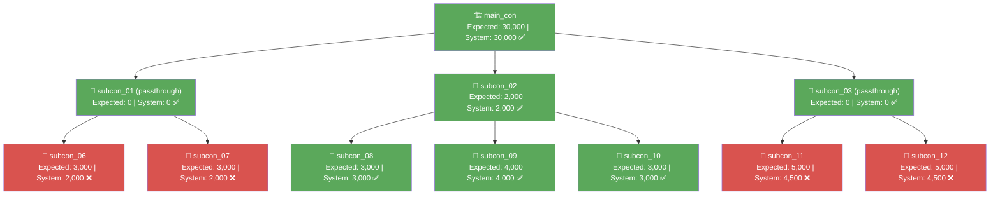

# VA Verification Report — DTF-DHV-AUTO-006 (August 2026)

> Compares **Expected VA** (manually calculated per `formula.md`, recorded in `report-dtf-006-aug.md`) against **Card Limit** (the live system's computed value, captured in `output/va-tree-response.json` for WR00000251, claim month 2026-08).

---

## Summary

| | Value |
|---|---|
| WR Number | WR00000251 (WR-DTF-DHV-006-Dev to Maincon) |
| Claim Month | 2026-08 |
| Total Nodes Compared | 11 |
| Matches | 7 |
| Mismatches | **4** |
| Result | ⚠️ **Manual formula incomplete — system applies proportional cap-down on passthrough that `formula.md` does not model** |

---

## Node-by-Node Comparison

| Actor | Vendor Name | Expected VA (calculated) | Card Limit (system) | Match |
|---|---|---|---|---|
| main_con | MAINCON PTE LTD | 30,000 | 30,000 | ✅ |
| subcon_01 | SUBCON 01 PTE LTD | 0 | 0 | ✅ |
| subcon_02 | SUBCON 02 PTE LTD | 2,000 | 2,000 | ✅ |
| subcon_03 | SUBCON 03 PTE LTD | 0 | 0 | ✅ |
| subcon_06 | SUBCON 06 PTE LTD | 3,000 | **2,000** | ❌ |
| subcon_07 | SUBCON 07 PTE LTD | 3,000 | **2,000** | ❌ |
| subcon_08 | SUBCON 08 PTE LTD | 3,000 | 3,000 | ✅ |
| subcon_09 | SUBCON 09 PTE LTD | 4,000 | 4,000 | ✅ |
| subcon_10 | SUBCON 10 PTE LTD | 3,000 | 3,000 | ✅ |
| subcon_11 | SUBCON 11 PTE LTD | 5,000 | **4,500** | ❌ |
| subcon_12 | SUBCON 12 PTE LTD | 5,000 | **4,500** | ❌ |
| **Total** | | 58,000 | **55,000** | — |

---

## Root Cause of the Mismatches

All 4 mismatches are leaf children of the two **passthrough** nodes from this month's tree:

- `subcon_01` claimed 4,000 but its children (`subcon_06` + `subcon_07`) together claimed 6,000.
- `subcon_03` claimed 9,000 but its children (`subcon_11` + `subcon_12`) together claimed 10,000.

`formula.md`'s current rule only handles the passthrough node itself (`VA = 0` when `invoice < childrenSum`) — it does **not** cascade the funding shortfall down to that node's children. The live system does cascade it, by **proportionally scaling each child's card_limit** to the amount actually available from the parent:

```
child_card_limit = child_claim × (parent_claim / children_claim_sum)
```

Verified against both passthrough branches:

| Parent | Parent Claim | Children Claim Sum | Ratio | Child | Child Claim | Computed | System card_limit |
|---|---|---|---|---|---|---|---|
| subcon_01 | 4,000 | 6,000 | 4000/6000 = 0.6667 | subcon_06 | 3,000 | 3000 × 0.6667 = **2,000** | 2,000 ✅ |
| subcon_01 | 4,000 | 6,000 | 4000/6000 = 0.6667 | subcon_07 | 3,000 | 3000 × 0.6667 = **2,000** | 2,000 ✅ |
| subcon_03 | 9,000 | 10,000 | 9000/10000 = 0.9 | subcon_11 | 5,000 | 5000 × 0.9 = **4,500** | 4,500 ✅ |
| subcon_03 | 9,000 | 10,000 | 9000/10000 = 0.9 | subcon_12 | 5,000 | 5000 × 0.9 = **4,500** | 4,500 ✅ |

This proportional-cap formula reproduces the system's card_limit exactly for all 4 previously-mismatched nodes.

---

## Conservation Check

```
Manual formula total VA   = 30000+0+2000+0+3000+3000+3000+4000+3000+5000+5000 = 58,000  ✗ (≠ root invoice 55,000)
System (proportional cap) = 30000+0+2000+0+2000+2000+3000+4000+3000+4500+4500 = 55,000  ✅ (= root invoice 55,000)
```

The system's calculation **preserves conservation** (total VA = root invoice) even under a multi-level passthrough, because it caps the downstream allocation to what the parent actually had available. The naive per-node `formula.md` rule does not cascade this cap, so it over-counts leaf VA whenever an upstream passthrough occurs — explaining why August's manual total (58,000) diverged from the root invoice while July's (which had no passthrough) matched exactly.

---

## Recommended Fix to `formula.md`

Extend `computeExpectedVaLimit` (or add a second pass after computing each node) so that whenever a node is in passthrough (`invoice < childrenSum`), each child's own computed VA is additionally scaled by `(node.invoice / childrenSum)` before that child's own children are evaluated — i.e. the ratio must propagate recursively down the affected subtree, not just to direct children. This keeps the formula's conservation property valid for trees with passthrough at any depth.

---

## Mermaid Diagram (mismatch highlighted)



---

## Conclusion

The system is **not wrong** — it correctly conserves the total VA (55,000 = root invoice) under passthrough by proportionally capping downstream leaf allocations. The manual `formula.md` calculation is **incomplete**: it stops the cap at the immediate passthrough node and never cascades the shortfall ratio to that node's children, causing leaf VA to be overstated by exactly the amount of the unfunded shortfall. This is the first tree tested (out of 006-July and 006-August) that exercises passthrough, and it's the first time this gap in the formula has surfaced.
