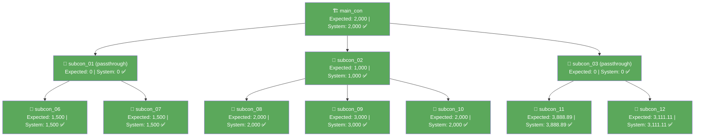

# VA Verification Report — DTF-DHV-AUTO-006 (September 2026)

> Compares **Expected VA** (manually calculated per `formula.md` Rule 4, recorded in `report-dtf-006-sept.md`) against **Card Limit** (the live system's computed value, captured in `output/va-tree-response.json` for WR00000251, claim month 2026-09).

---

## Summary

| | Value |
|---|---|
| WR Number | WR00000251 (WR-DTF-DHV-006-Dev to Maincon) |
| Claim Month | 2026-09 |
| Total Nodes Compared | 11 |
| Matches | **11** |
| Mismatches | 0 |
| Result | ✅ **All nodes match exactly — including fractional VA values** |

---

## Node-by-Node Comparison

| Actor | Vendor Name | Expected VA (Rule 4) | Card Limit (system) | Match |
|---|---|---|---|---|
| main_con | MAINCON PTE LTD | 2,000 | 2,000 | ✅ |
| subcon_01 | SUBCON 01 PTE LTD | 0 | 0 | ✅ |
| subcon_02 | SUBCON 02 PTE LTD | 1,000 | 1,000 | ✅ |
| subcon_03 | SUBCON 03 PTE LTD | 0 | 0 | ✅ |
| subcon_06 | SUBCON 06 PTE LTD | 1,500 | 1,500 | ✅ |
| subcon_07 | SUBCON 07 PTE LTD | 1,500 | 1,500 | ✅ |
| subcon_08 | SUBCON 08 PTE LTD | 2,000 | 2,000 | ✅ |
| subcon_09 | SUBCON 09 PTE LTD | 3,000 | 3,000 | ✅ |
| subcon_10 | SUBCON 10 PTE LTD | 2,000 | 2,000 | ✅ |
| subcon_11 | SUBCON 11 PTE LTD | 3,888.89 | 3,888.89 | ✅ |
| subcon_12 | SUBCON 12 PTE LTD | 3,111.11 | 3,111.11 | ✅ |
| **Total** | | **20,000** | **20,000** | ✅ |

---

## Why This Confirmation Matters

This is the **second independent live dataset** (after August) to validate Rule 4's cascading passthrough cap — and the first to confirm it on **fractional, non-whole-number VA values**:

- `subcon_03` (claim 7,000) is in passthrough against its children (`subcon_11` 5,000 + `subcon_12` 4,000 = 9,000), giving ratio `7000/9000 = 0.777...`
- The system computed `subcon_11`'s `card_limit` as **3888.89** and `subcon_12`'s as **3111.11** — both exactly matching `5000 × 0.7778` and `4000 × 0.7778` rounded to 2 decimal places.
- This rules out any simpler explanation (e.g. equal-split passthrough, or rounding to whole dollars) — the system is performing **claim-proportional** redistribution with cent-level precision, exactly as Rule 4 specifies.

Two passthrough branches were active simultaneously this month (`subcon_01` and `subcon_03`), and both cascaded correctly and independently — confirming the rule generalizes across multiple concurrent passthrough subtrees in the same tree, not just a single isolated case.

---

## Conservation Check

```
Expected (Rule 4) = 2000+0+1000+0+1500+1500+2000+3000+2000+3888.89+3111.11 = 20,000.00
System (live)     = 2000+0+1000+0+1500+1500+2000+3000+2000+3888.89+3111.11 = 20,000.00
main_con invoice (root)                                                    = 20,000.00
✅ All three values agree exactly.
```

---

## Mermaid Diagram (match status)



---

## Conclusion

`formula.md`'s Rule 4 (cascading passthrough cap) is now confirmed against **two** independent live months (August and September 2026) for DTF-DHV-AUTO-006 / WR00000251. September adds the strongest evidence yet: two concurrent passthrough branches, one of which produces non-integer cent-precision VA values that match the system's `card_limit` to the exact cent. No further open questions remain about how the system distributes an under-funded claim across multiple children.
