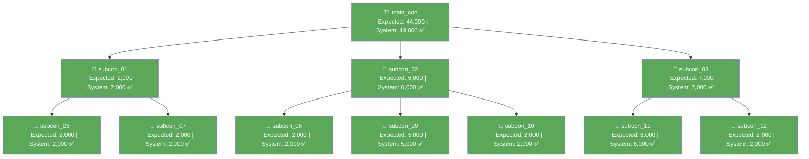

# VA Verification Report — DTF-DHV-AUTO-006

> Compares **Expected VA** (manually calculated via the VA formula in `formula.md`, recorded in `report-dtf-006.md`) against **Card Limit** (the live system's computed value, captured in `output/va-tree-response.json` for WR00000251, claim month 2026-07).

---

## Summary

| | Value |
|---|---|
| WR Number | WR00000251 (WR-DTF-DHV-006-Dev to Maincon) |
| Claim Month | 2026-07 |
| Total Nodes Compared | 11 |
| Matches | 11 |
| Mismatches | 0 |
| Result | ✅ **All nodes match — system calculation confirms manual VA formula** |

---

## Node-by-Node Comparison

| Actor | Vendor Name | Expected VA (calculated) | Card Limit (system) | Match |
|---|---|---|---|---|
| main_con | MAINCON PTE LTD | 44,000 | 44,000 | ✅ |
| subcon_01 | SUBCON 01 PTE LTD | 2,000 | 2,000 | ✅ |
| subcon_02 | SUBCON 02 PTE LTD | 6,000 | 6,000 | ✅ |
| subcon_03 | SUBCON 03 PTE LTD | 7,000 | 7,000 | ✅ |
| subcon_06 | SUBCON 06 PTE LTD | 2,000 | 2,000 | ✅ |
| subcon_07 | SUBCON 07 PTE LTD | 2,000 | 2,000 | ✅ |
| subcon_08 | SUBCON 08 PTE LTD | 2,000 | 2,000 | ✅ |
| subcon_09 | SUBCON 09 PTE LTD | 5,000 | 5,000 | ✅ |
| subcon_10 | SUBCON 10 PTE LTD | 2,000 | 2,000 | ✅ |
| subcon_11 | SUBCON 11 PTE LTD | 6,000 | 6,000 | ✅ |
| subcon_12 | SUBCON 12 PTE LTD | 2,000 | 2,000 | ✅ |
| **Total** | | **80,000** | **80,000** | ✅ |

---

## Conservation Check

```
SUM(all card_limit) = 44000 + 2000 + 6000 + 7000 + 2000 + 2000 + 2000 + 5000 + 2000 + 6000 + 2000
                     = 80,000
main_con invoice_amount (root) = 80,000
✅ Conservation holds — system's card_limit values sum exactly to the root invoice.
```

---

## Mermaid Diagram (match status)



---

## Conclusion

The system's VA calculation engine (reflected in `card_limit` for each WR node in the live `dtfOverview` API response) is fully consistent with the manual VA formula (`VA = invoice − SUM(children invoices)`, leaf = own invoice) defined in `formula.md`. No discrepancies found across all 11 nodes in the DTF-DHV-AUTO-006 tree for claim month July 2026.
