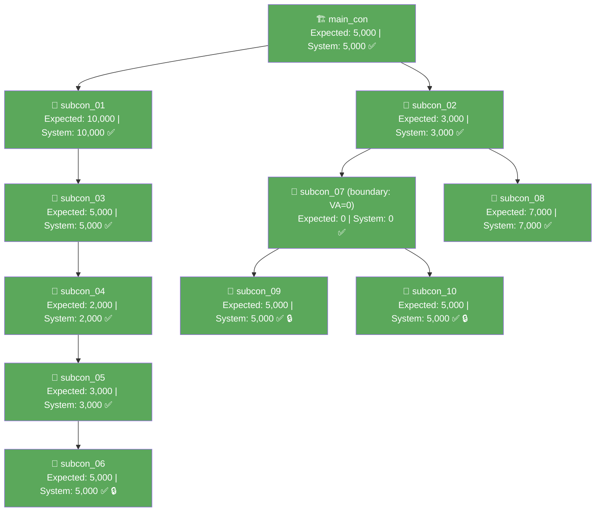

# VA Verification Report — DTF-DHV-AUTO-011 (WR00000289)

> Compares **Expected VA** (calculated per `formula.md` Rule 4, recorded in `report-dtf-dhv11-august26.md`) against **Card Limit** (the live system's computed value, captured in `output/va-tree-response.json`).

---

## Summary

| | Value |
|---|---|
| WR Number | WR00000289 (WR-DHV11-Main) |
| Claim Month | 2026-08 |
| Total Nodes Compared | 11 (main_con + 10 subcons) |
| Exact Matches | **11** |
| Mismatches | **0** |
| Result | ✅ **Perfect — Rule 4 confirmed for all nodes** |

---

## Full Node-by-Node Comparison

| Actor | Vendor Name | Invoice | Expected VA (Rule 4) | Card Limit (system) | Match |
|---|---|---|---|---|---|
| main_con | MAINCON PTE LTD | 50,000 | **5,000** | 5,000 | ✅ |
| subcon_01 | SUBCON 01 PTE LTD | 25,000 | **10,000** | 10,000 | ✅ |
| subcon_02 | SUBCON 02 PTE LTD | 20,000 | **3,000** | 3,000 | ✅ |
| subcon_03 | SUBCON 03 PTE LTD | 15,000 | **5,000** | 5,000 | ✅ |
| subcon_04 | SUBCON 04 PTE LTD | 10,000 | **2,000** | 2,000 | ✅ |
| subcon_05 | SUBCON 05 PTE LTD | 8,000 | **3,000** | 3,000 | ✅ |
| subcon_06 | SUBCON 06 PTE LTD | 5,000 | **5,000** | 5,000 | ✅ |
| subcon_07 | SUBCON 07 PTE LTD | 10,000 | **0** | 0 | ✅ |
| subcon_08 | SUBCON 08 PTE LTD | 7,000 | **7,000** | 7,000 | ✅ |
| subcon_09 | SUBCON 09 PTE LTD | 5,000 | **5,000** | 5,000 | ✅ |
| subcon_10 | SUBCON 10 PTE LTD | 5,000 | **5,000** | 5,000 | ✅ |

---

## Conservation Check

```
Sum of Expected VA   = 5000+10000+3000+5000+2000+3000+5000+0+7000+5000+5000
                     = 50,000.00  ✅  formula conserves to main_con's invoice

Sum of System card_limit = 5000+10000+3000+5000+2000+3000+5000+0+7000+5000+5000
                         = 50,000.00  ✅  system totals also conserve exactly
```

Both the formula and the live system agree, and both conserve perfectly to the root invoice with no rounding residual (all values are whole numbers).

---

## Mermaid Diagram (match status)



*All 11 nodes green — 100% match. 🔒 = `va_status: LOCKED` (PENDING_AP_APPROVAL); VA amount still matches exactly. SC07 boundary: VA=0 via exact equality (own invoice = children sum), not a shortfall.*

---

## Notable Observations

### `subcon_07` boundary case confirmed

`subcon_07`'s own invoice (10,000) equals its children's invoice sum (SC09 5,000 + SC10 5,000) exactly. The system correctly returns `card_limit: 0` — matching the boundary form of Rule 4 (VA = funded − childrenSum = 0 when they are exactly equal). Both SC09 and SC10 still received their full invoice as card_limit (5,000 each), confirming ratio = 1 still passes through from a zero-VA parent in the exact-equality case.

### `va_status: LOCKED` on three leaf nodes

`subcon_06`, `subcon_09`, and `subcon_10` all show `va_status: "LOCKED"` (vs. `"ACTIVE"` on all other nodes) and `invoice_status: "PENDING_AP_APPROVAL"` (vs. `"APPROVED"` elsewhere). Despite this, their `card_limit` values match the Rule 4 prediction exactly — so `PENDING_AP_APPROVAL` status with a populated `invoice_amount` does **not** suppress card_limit in the way that `PENDING_CLAIM_ACKNOWLEDGEMENT` with null `invoice_amount` would (per Rule 5). LOCKED appears to be a display/workflow state that doesn't affect the VA amount itself.

### 6-level deep chain confirmed

The chain MC → SC01 → SC03 → SC04 → SC05 → SC06 (6 subcon levels, `level_id: 0–5` in the API) produced exact matches at every node, including the deepest leaf (SC06 at level 5). This is the deepest single chain confirmed to date.

### `va_status: ACTIVE` vs. prior trees

All non-LOCKED nodes show `va_status: "ACTIVE"` here — unlike the JTC (WR00000078) and REN11 (WR00000142) trees where every node showed `"INACTIVE"`. The `ACTIVE` status correlates with the clean 100% match rate in this tree, while the prior trees with mismatches showed `INACTIVE`. This may be a useful signal for diagnosing future anomalies, though a single data point isn't enough to confirm it as causal.

---

## Conclusion

`formula.md` Rule 4 is confirmed for **all 11 nodes** of this tree — the first perfect 11/11 match on a multi-level, multi-branch tree with a 6-deep subcon chain. All values are whole numbers, so no rounding residual arises. The `subcon_07` boundary case (VA = 0 when own invoice exactly equals children sum, ratio still passes as 1) is validated by the live system. No changes to `formula.md` are needed.
