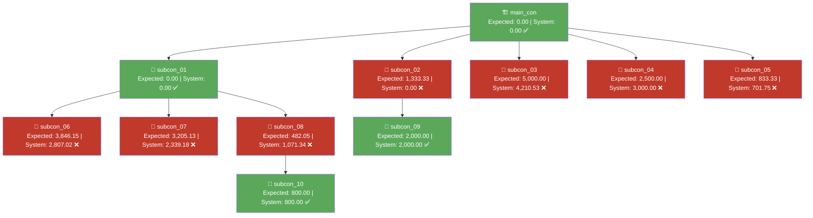

# VA Verification Report — REN_11 (WR00000142, claim month 2026-02)

> Compares **Expected VA** (manually calculated in `output/va-report-ren11-feb26.md`
> via the VA formula in [`formula.md`](../.claude/skills/formula.md), Rules 1–4)
> against **Card Limit** (the live system's computed value, captured in
> `output/va-tree-response.json`).

---

## Summary

| | Value |
|---|---|
| Root WR | WR00000142 (REN11_MAIN) |
| Claim Month | 2026-02 |
| Total Nodes Compared | 11 |
| Matches | 4 |
| Mismatches | 7 |
| Result | ❌ **Majority mismatch — the confirmed Rule 1–4 formula does not reproduce this tree's card_limit** |

---

## Node-by-Node Comparison

| Node | Vendor | Own Invoice | Expected VA (formula) | Card Limit (system) | Diff | Match |
|---|---|---:|---:|---:|---:|---|
| main_con | MAINCON PTE LTD | 20,000 | 0.00 | 0.00 | 0.00 | ✅ |
| subcon_01 | SUBCON 01 PTE LTD | 10,000 | 0.00 | 0.00 | 0.00 | ✅ |
| subcon_02 | SUBCON 02 PTE LTD | 4,000 | 1,333.33 | 0.00 | −1,333.33 | ❌ |
| subcon_03 | SUBCON 03 PTE LTD | 6,000 | 5,000.00 | 4,210.53 | −789.47 | ❌ |
| subcon_04 | SUBCON 04 PTE LTD | 3,000 | 2,500.00 | 3,000.00 | +500.00 | ❌ |
| subcon_05 | SUBCON 05 PTE LTD | 1,000 | 833.33 | 701.75 | −131.58 | ❌ |
| subcon_06 | SUBCON 06 PTE LTD | 6,000 | 3,846.15 | 2,807.02 | −1,039.13 | ❌ |
| subcon_07 | SUBCON 07 PTE LTD | 5,000 | 3,205.13 | 2,339.18 | −865.95 | ❌ |
| subcon_08 | SUBCON 08 PTE LTD | 2,000 | 482.05 | 1,071.34 | +589.29 | ❌ |
| subcon_09 | SUBCON 09 PTE LTD | 2,000 | 2,000.00 | 2,000.00 | 0.00 | ✅ |
| subcon_10 | SUBCON 10 PTE LTD | 800 | 800.00 | 800.00 | 0.00 | ✅ |
| **Total** | | **60,800** | **~19,999.99** | **16,929.82** | **−3,070.17** | ❌ |

---

## Conservation check

```
SUM(expected VA)  = 19,999.99  ≈ main_con invoice (20,000)   ✅ formula conserves internally
SUM(card_limit)   = 0 + 0 + 0 + 4210.53 + 3000 + 701.75
                    + 2807.02 + 2339.18 + 1071.34 + 2000 + 800
                  = 16,929.82  ≠ main_con invoice (20,000)   ❌ system does NOT conserve to root
```

The live system's own `card_limit` values fall short of the root invoice by **3,070.18** — this mismatch is not just a formula error, the system's totals don't add back up to what main_con was actually invoiced for either.

---

## What matches, what doesn't

**Matches (4/11):** `main_con`, `subcon_01` (both passthrough, VA correctly 0), and `subcon_09`, `subcon_10` — notably the two nodes whose card_limit equals their own **raw, unscaled invoice_amount** exactly (2,000 and 800), with no funding-ratio cascade applied at all.

**Mismatches (7/11), by branch:**
- **subcon_02** (0 actual vs 1,333.33 expected): the system treated it as fully zeroed out despite `own invoice (4,000) > child invoice (2,000)`, which per Rule 1/3 should leave a positive VA. This is the same shape as a passthrough result, but nothing upstream should have forced it — main_con's shortfall was already modeled as applying only via the funded-invoice cascade, and 3,333.33 (funded) still exceeds 2,000.
- **subcon_06 / subcon_07** (children of subcon_01): both scaled down from their raw invoice by a consistent ratio — `2,807.02 / 6,000 = 0.46784` and `2,339.18 / 5,000 = 0.46784` — but this ratio **does not match** the `0.6410` cascade ratio Rule 4 predicts for subcon_01 (`8,333.33 funded / 13,000 children-sum`). The system is applying some other, currently unidentified scaling factor here.
- **subcon_08** (child of subcon_01, parent of subcon_10): actual (1,071.34) is *higher* than expected (482.05), and subcon_08's own child `subcon_10` is unscaled (800, full raw invoice) — so whatever ratio hit subcon_06/07 did not propagate past subcon_08 to subcon_10.
- **subcon_03 / subcon_04 / subcon_05** (main_con's other leaf children): each is off by a different, non-proportional amount (−789.47, +500.00, −131.58) — not a single shared ratio, ruling out a simple uniform cascade at the main_con level either.

No single scaling factor explains all seven mismatches simultaneously, and the system's own numbers don't conserve to the root invoice — so this isn't resolvable by adjusting the manual formula alone.

---

## Mermaid diagram (match status)



---

## Open anomaly

This is the first tree with a **5-way fan-out at the root** (main_con → 5 direct subcons) and a **3-level-deep branch** (main_con → subcon_01 → subcon_08 → subcon_10) tested against a live system response. Rules 1–4 were previously confirmed only on trees with ≤3 children per node; they do not reproduce this tree's `card_limit` values, and the system's own totals don't conserve to the root invoice either — mirroring the unexplained mismatches flagged for DTF-JTC-2025-06 in `formula.md`, but at a much higher proportion (7 of 11 nodes vs. 1–3 previously).

**Not folded into `formula.md`** — flagged here as an open question. Before revising the formula, worth checking whether `subcon_08`/`subcon_10`'s `PENDING_AP_APPROVAL` invoice status (the only two nodes with that status, vs. `APPROVED` everywhere else) plays a role, since Rule 5 only currently accounts for `PENDING_CLAIM_ACKNOWLEDGEMENT` with a null `invoice_amount`, not this status with a populated amount.
