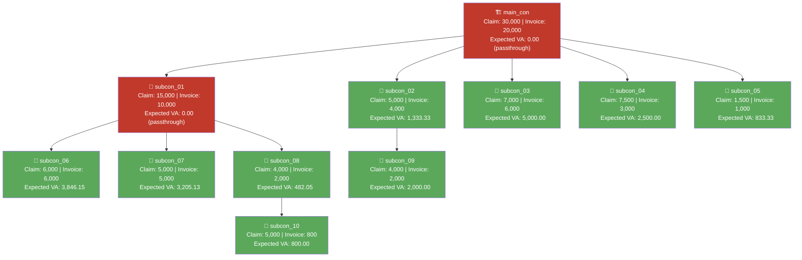

# VA Calculation Report — REN_11 (claim month 2026-02)

> Calculated from `data/data_ren11-feb26.json` using the VA formula in
> [`formula.md`](../.claude/skills/formula.md) (Rules 1–4, cascading passthrough).
> This is a **pre-run seed data report** — no live system response exists yet
> for this project, so there is nothing to compare `expected_va` against. Once
> the WR is raised and claims are submitted, capture the API tree and diff its
> `card_limit` values against the `expected_va` column below.

---

## Tree structure

```
main_con
├─ subcon_01
│  ├─ subcon_06 (leaf)
│  ├─ subcon_07 (leaf)
│  └─ subcon_08
│     └─ subcon_10 (leaf)
├─ subcon_02
│  └─ subcon_09 (leaf)
├─ subcon_03 (leaf)
├─ subcon_04 (leaf)
└─ subcon_05 (leaf)
```

11 nodes total (1 root + 10 subcons), 3 levels deep (main_con → subcon_08 → subcon_10 is the longest chain).

---

## Node table

| Node | Claim Amount | Invoice Amount | Funded Invoice | Children Sum | Expected VA | Status |
|---|---:|---:|---:|---:|---:|---|
| main_con | 30,000 | 20,000 | 20,000.00 | 24,000 | **0.00** | passthrough (ratio 0.8333) |
| subcon_01 | 15,000 | 10,000 | 8,333.33 | 13,000 | **0.00** | passthrough (ratio 0.6410) |
| subcon_02 | 5,000 | 4,000 | 3,333.33 | 2,000 | **1,333.33** | funded |
| subcon_03 | 7,000 | 6,000 | 5,000.00 | 0 | **5,000.00** | leaf |
| subcon_04 | 7,500 | 3,000 | 2,500.00 | 0 | **2,500.00** | leaf |
| subcon_05 | 1,500 | 1,000 | 833.33 | 0 | **833.33** | leaf |
| subcon_06 | 6,000 | 6,000 | 3,846.15 | 0 | **3,846.15** | leaf |
| subcon_07 | 5,000 | 5,000 | 3,205.13 | 0 | **3,205.13** | leaf |
| subcon_08 | 4,000 | 2,000 | 1,282.05 | 800 | **482.05** | funded |
| subcon_09 | 4,000 | 2,000 | 2,000.00 | 0 | **2,000.00** | leaf |
| subcon_10 | 5,000 | 800 | 800.00 | 0 | **800.00** | leaf |
| **Total** | **90,000** | **60,800** | | | **~20,000.00** | |

---

## Why main_con and subcon_01 hit passthrough

- **main_con**: invoice (20,000) < sum of its 5 children's invoices (10,000 + 4,000 + 6,000 + 3,000 + 1,000 = 24,000) → Rule 2/4 kicks in. VA = 0, and every child's funded invoice is scaled by `20000/24000 = 0.8333` before those children compute their own VA.
- **subcon_01**: after receiving its scaled-down funded invoice (8,333.33), its own children still add up to more (6,000 + 5,000 + 2,000 = 13,000) → passthrough again. VA = 0, ratio `8333.33/13000 = 0.6410` cascades further down to subcon_06/07/08.
- **subcon_02** and **subcon_08**, by contrast, receive enough funded invoice to cover their single child, so they keep the remainder as their own VA (Rule 1/3).

This is why subcon_02/05/06/07/08 show non-round decimal `expected_va` values — they're the product of two cascaded ratios (main_con's 0.8333 × subcon_01's 0.6410, for the subcon_06/07/08 branch).

---

## Conservation check

```
SUM(all expected_va) = 0 + 0 + 1333.33 + 5000 + 2500 + 833.33
                       + 3846.15 + 3205.13 + 482.05 + 2000 + 800
                     = 19,999.99  (≈ 20,000, off by 1 cent from independent per-leaf rounding)

main_con invoice_amount (root) = 20,000
✅ Conservation holds within rounding — matches the root invoice.
```

---

## Mermaid diagram



Red = passthrough node (VA = 0, funding shortfall cascades to children). Green = fully funded (VA computed normally).

---

## Open item

`expected_va` here is a **manual calculation**, not yet verified against a live `card_limit`. Once WR/claims are raised for this project and the API tree is captured (e.g. into `output/va-tree-response-ren11.json`), re-run the comparison to confirm the system agrees — particularly on the two cascaded passthrough branches (subcon_01's children), since that's the highest-risk case per Rule 4.
